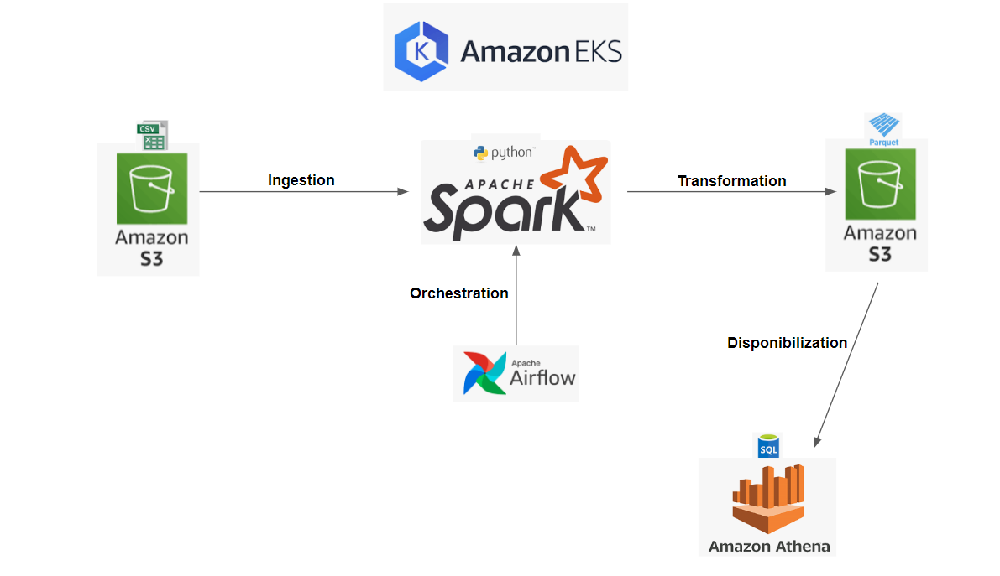

<h3 align="center">Final Challenge by Post Graduation in Data Engineering - XPE (1º part)</h3>

---

## 📝 Content

- [Architecture](#architecture)
- [Author](#authors)

## Architecture of Data ingestion in Batch 

## ⛏️ Built Using 

- EKS
- Spark Operator
- Airflow
- AWS Athena
- Python 
- SQL

## ✍️ Authors 

- [@vinicunhac](https://github.com/vinicunhac)
